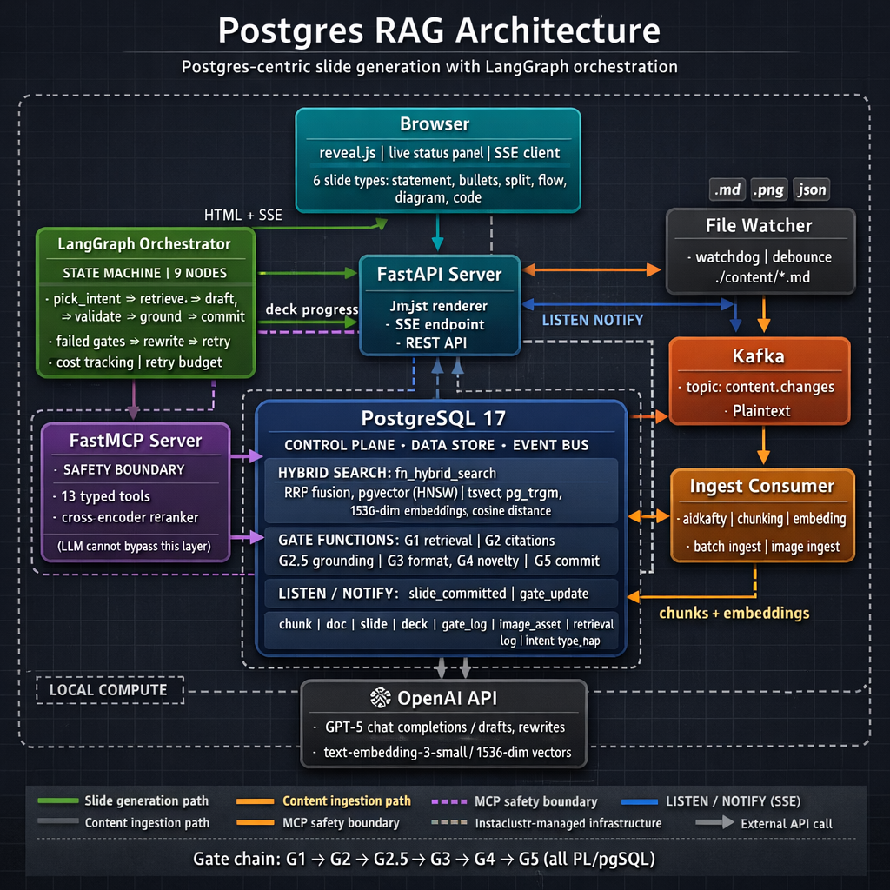
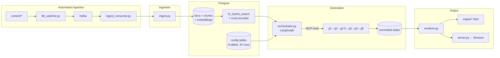

# Postgres as an AI Control Plane - RAG based automated slide deck generator demo

**Building RAG + MCP Workflows Inside the Database**

`Python 3.12` · `Postgres 16+` · `pgvector` · `LangGraph` · `FastMCP` · `Kafka` · `670+ tests`

A Postgres-centric AI slide generator that produces structured presentations using RAG retrieval, LLM drafting, and a six-gate validation pipeline — all orchestrated through Postgres. Built as a live demo for [Scale23x (March 2026)](https://www.socallinuxexpo.org/scale/23x/presentations/postgres-ai-control-plane-building-rag-mcp-workflows-inside-database). For the talk thesis, see [docs/thesis.md](docs/thesis.md).

---

## What This Is

This system generates its own talk slides. Markdown content about Postgres as an AI control plane is ingested, chunked, and embedded into a Postgres knowledge base. A LangGraph orchestrator drafts slides via the configured LLM (default: GPT-5), validates each one through six database-enforced gates (citation integrity, semantic grounding, format compliance, novelty), and commits them atomically. The renderer composes HTML from DB-driven templates and streams slides to the browser in real-time via SSE.

The thesis: **Postgres is the control plane. The LLM is a contractor.** The system proves this by using Postgres for validation, configuration, retrieval, and observability — the LLM only drafts content.

## Architecture





---

## Quick Start

### Prerequisites

- Python 3.12+
- Postgres 16+ with extensions: `pgvector`, `pg_trgm`, `pgcrypto`, `unaccent`
- Docker (for Kafka)
- OpenAI API key

### Setup

```bash
git clone <repo-url> && cd scale23x_demo
python -m venv .venv && source .venv/bin/activate
pip install -r requirements.txt

cp .env.example .env
# Edit .env: set DATABASE_URL and OPENAI_API_KEY

# Start Kafka (KRaft mode, single-node)
docker compose up -d

# Initialize database (schema + all migrations)
psql "$DATABASE_URL" -f db/schema.sql
for f in db/migrations/0*.sql; do
  [[ "$f" == *rollback* ]] && continue
  psql "$DATABASE_URL" -f "$f"
done

# Ingest content (manual, one-time) NOTE: Conference slides included author's personal Obsibian Vault notes as part of RAG content which aren't made public here, so the reproduction of exact conference slide material will not be possible. You are welcome to ingest new, original, or curated content on any topic to generate new slide decks.
python -m src.ingest
```

---

## Usage

### CLI Pipeline (batch mode)

Generate slides into Postgres, then render to a static HTML file.

```bash
# Generate slides
python -m src.orchestrator --topic "Postgres as an AI Control Plane"

# Render to HTML
python -m src.renderer --deck-id <uuid> --theme postgres --output output/deck.html

# Open (macOS) — press S for speaker notes
open output/deck.html
```

| Command | Flag | Default | Purpose |
|---------|------|---------|---------|
| `orchestrator` | `--topic` | (required) | Topic for new deck |
| | `--deck-id` | None | Resume an existing deck |
| | `--verbose` | false | Debug logging |
| `renderer` | `--deck-id` | (required) | Deck UUID to render |
| | `--output` | `output/deck_<id>.html` | Output file path |
| | `--theme` | `dark` | `dark` or `postgres` |
| | `--save-fallback` | false | Also save as `output/fallback_deck.html` |

### Live Server (progressive mode)

Generate and stream slides to the browser in real-time via SSE.

```bash
python -m src.server --topic "Postgres as an AI Control Plane" --theme postgres
```

The server opens your browser, shows title + thanks slides immediately, then streams generated slides as they're committed. A live status panel shows generation phase, gate results, and cost.

| Flag | Default | Purpose |
|------|---------|---------|
| `--topic` | (required unless `--deck-id`) | Topic for new deck |
| `--deck-id` | None | Resume an existing deck |
| `--port` | 8000 | Server port |
| `--theme` | `dark` | `dark` or `postgres` |
| `--no-browser` | false | Don't auto-open browser |

| Endpoint | Description |
|----------|-------------|
| `GET /` | Live deck page |
| `GET /api/stream/{deck_id}` | SSE event stream |
| `GET /health` | Server health + generation status |
| `GET /images/{filename}` | Static image assets |

### Automated Ingestion (Kafka)

Start the file watcher and consumer to automatically ingest content changes:

```bash
# Terminal 1: File watcher (publishes to Kafka on create/modify)
python -m src.file_watcher

# Terminal 2: Ingest consumer (processes events from Kafka)
python -m src.ingest_consumer
```

Edit any file in `content/external/*.md` or `content/images/*` and it will be automatically chunked, embedded, and ingested into Postgres.

### Other Commands

```bash
python -m src.run_report --deck-id <uuid> --verbose   # Run report
python -m src.ingest_images                            # Ingest images
python -m pytest tests/ -v                             # Run tests
python -m pytest tests/ --cov=src --cov-report=html    # Coverage
```

---

## Configuration

Operational config (thresholds, model names, limits, toggles) lives in the Postgres `config` table — not `.env`. This was centralized in migration 013.

The `.env` file contains only secrets and infrastructure:

| Variable | Purpose |
|----------|---------|
| `DATABASE_URL` | (required) Postgres connection string |
| `OPENAI_API_KEY` | (required) OpenAI API key |
| `OPENAI_API_BASE` | Custom API base URL |
| `OPENAI_USER` | OpenAI user identifier |
| `SSL_VERIFY` | SSL certificate verification (default: `true`) |
| `HF_HOME` | HuggingFace cache directory |
| `IMAGE_CONTENT_DIR` | Image assets directory (default: `content/images`) |
| `KAFKA_BOOTSTRAP_SERVERS` | Kafka broker (default: `localhost:9092`) |
| `KAFKA_TOPIC` | Kafka topic (default: `content.changes`) |

To view or change operational config:

```sql
-- View all config
SELECT key, value, value_type, category FROM config ORDER BY category, key;

-- Change a threshold
UPDATE config SET value = '0.9' WHERE key = 'novelty_threshold';
-- Then restart the app to pick up changes
```

See [docs/architecture.md](docs/architecture.md) for the full config key reference.

---

## Documentation

| Document | Description |
|----------|-------------|
| [architecture.md](docs/architecture.md) | System overview, tech stack, data flow, design principles, env vars |
| [database.md](docs/database.md) | ER diagram, 15 tables, 20 functions, 8 enums, 4 views, 21 migrations |
| [retrieval-pipeline.md](docs/retrieval-pipeline.md) | Chunking, embeddings, hybrid search, RRF, two-stage reranking, image search |
| [mcp-tools.md](docs/mcp-tools.md) | 15-tool MCP inventory, safety boundary, architecture |
| [orchestrator.md](docs/orchestrator.md) | LangGraph state machine, rewrite loops, 5 safety limits |
| [gate-validation.md](docs/gate-validation.md) | G0–G5 gate sequence, thresholds, logging |
| [rendering.md](docs/rendering.md) | Slide types, DB-driven templates, fragment composition, themes, SSE streaming |
| [observability.md](docs/observability.md) | Audit tables, views, cost tracking, Metabase, useful queries |
| [extending.md](docs/extending.md) | How to add slide types, intents, themes, content, prompts |
| [thesis.md](docs/thesis.md) | The talk thesis with proof points and before/after comparison |

---

## Project Structure

```
src/
  orchestrator.py      # LangGraph state machine for slide generation
  server.py            # FastAPI live server with SSE streaming
  renderer.py          # Jinja2 -> HTML rendering with DB-driven fragments
  llm.py               # LLM wrapper with cost tracking (model from config table)
  mcp_server.py        # 15 MCP tools wrapping Postgres functions
  mcp_client.py        # In-process MCP client (in-memory transport)
  db.py                # asyncpg connection pool
  config.py            # Postgres config table loader (replaces os.getenv)
  models.py            # Pydantic schemas, DB cache loaders (enums loaded from pg_enum)
  ingest.py            # Markdown -> chunks -> embeddings
  ingest_images.py     # Image ingestion pipeline
  file_watcher.py      # Watchdog monitor -> Kafka producer
  ingest_consumer.py   # Kafka consumer -> ingest pipeline
  content_utils.py     # Shared walk_content_data() for field traversal
  load_fragments.py    # Dev helper: load HTML fragments into DB
  run_report.py        # CLI run report viewer

templates/
  reveal_base.html         # Static HTML export template
  reveal_live.html         # Live server template with SSE + status panel
  slide_fragment.html      # Single-slide fragment for SSE injection
  _slide_type_body.html    # Filesystem fallback for slide type dispatch
  fragments/               # Per-type HTML fragments (source for DB)

db/
  schema.sql               # Base schema (8 tables, 6 enums, 4 views, 13 functions)
  migrations/              # 21 forward migrations (001-019, two 009_* files)

docker-compose.yml         # Kafka (KRaft mode, single-node, plaintext)

content/
  external/                # Markdown content sources

tests/
  unit/                    # Unit tests
  integration/             # Integration tests

docs/
  architecture.md          # System architecture
  database.md              # Schema reference
  retrieval-pipeline.md    # RAG pipeline
  mcp-tools.md             # MCP tool inventory
  orchestrator.md          # Generation state machine
  gate-validation.md       # Gate sequence
  rendering.md             # Template and rendering
  observability.md         # Logging and monitoring
  extending.md             # Extension guide
  thesis.md                # Talk thesis
```
