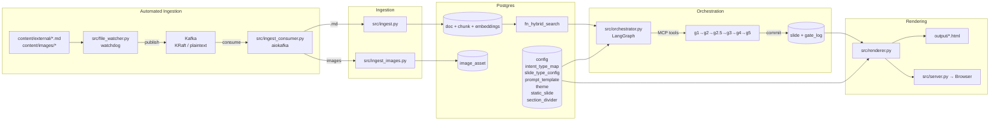

# Architecture

## System Overview

This system generates structured reveal.js presentations from a Postgres-backed knowledge base. Content is ingested as markdown, chunked and embedded for retrieval, then an LLM drafts slides that pass through a six-gate validation pipeline before being committed to the database. The renderer composes final HTML from DB-driven templates. A live server streams slides to the browser in real-time via SSE as they're generated.

## Technology Stack

| Layer | Technology | Role |
|-------|-----------|------|
| Database | Postgres 16+ with pgvector, pg_trgm, pgcrypto, unaccent | Storage, retrieval, validation, configuration, audit |
| Async DB driver | asyncpg | Connection pooling and async query execution |
| LLM | OpenAI GPT-4/5 (configurable via `config` table) | Slide content drafting and rewrites |
| Embeddings | OpenAI `text-embedding-3-small` (1536 dimensions) | Semantic search and grounding verification |
| Reranker | `cross-encoder/ms-marco-MiniLM-L6-v2` (sentence-transformers) | Two-stage retrieval reranking |
| Orchestration | LangGraph | State machine for the generate-validate-commit loop |
| Tool interface | FastMCP (in-process, in-memory transport) | Safety boundary between LLM and database |
| Event streaming | Kafka (KRaft mode, Docker) | Automated content ingestion pipeline |
| File watching | watchdog | Filesystem monitoring for content changes |
| Kafka client | aiokafka / kafka-python | Async consumer and sync producer |
| Web framework | FastAPI | Live server with SSE streaming |
| Templating | Jinja2 | DB-driven fragment composition for slide HTML |
| Presentation engine | Custom reveal.js-style engine (~200 lines JS) | Navigation, speaker notes, viewport scaling |
| Validation | Pydantic v2 | Request/response schemas, config models |
| Retry logic | tenacity | LLM API call retries with exponential backoff |
| CLI output | rich | Formatted terminal output for run reports |

## Data Flow



SSE streaming uses dual channels: Postgres LISTEN/NOTIFY for slide commits and gate updates, plus an in-process asyncio.Queue for progress events. See [rendering.md](rendering.md) for details.

## Subsystem Map

| File | Responsibility |
|------|---------------|
| `src/db.py` | asyncpg connection pool (`init_pool`, `get_connection`, `transaction`) |
| `src/config.py` | Postgres `config` table loader — replaces `os.getenv()` for all operational config (thresholds, model names, limits) |
| `src/models.py` | Pydantic models, DB cache loaders for all config tables (enums validated dynamically against pg_enum) |
| `src/ingest.py` | Markdown → chunks → embeddings pipeline with G0 ingestion gate |
| `src/ingest_images.py` | Image ingestion with JSON sidecar validation and caption embeddings |
| `src/file_watcher.py` | Watchdog-based filesystem monitor, publishes create/modify events to Kafka |
| `src/ingest_consumer.py` | Kafka consumer that routes events to `ingest_document()` or `ingest_single_image()` |
| `src/llm.py` | LLM wrapper with cost tracking, prompt formatting from DB-cached templates, slide drafting and rewriting (model from config table) |
| `src/mcp_server.py` | FastMCP server with 15 tools wrapping Postgres functions |
| `src/mcp_client.py` | In-process MCP client singleton routing calls through in-memory transport |
| `src/orchestrator.py` | LangGraph state machine: 9 nodes, conditional edges, safety limits, generation run lifecycle |
| `src/renderer.py` | Jinja2 rendering with DB-driven fragment composition, static slide injection, theme loading |
| `src/server.py` | FastAPI live server with SSE streaming, Postgres LISTEN/NOTIFY, auto-save on completion |
| `src/run_report.py` | CLI run report viewer querying views and generation_run table |
| `src/content_utils.py` | Shared `walk_content_data()` for applying transforms to slide text fields using DB-driven field maps |
| `src/load_fragments.py` | Dev workflow helper: loads HTML fragments from `templates/fragments/` into `slide_type_config.html_fragment` |

## Design Principles

Five architectural patterns define this system:

1. **Postgres as control plane.** Configuration, validation rules, prompt templates, slide type definitions, themes, and static content all live in Postgres tables. Python reads them at startup and caches them; quality thresholds are DB-driven.

2. **Gate validation sequence.** Every slide passes through six gates (G0–G5) before it reaches the database. Generation-time gates (G1–G5) are PL/pgSQL functions that enforce retrieval quality, citation integrity, semantic grounding, format compliance, and content novelty. G0 (ingestion policy) runs in Python. See [gate-validation.md](gate-validation.md).

3. **Views as active sensors.** Four database views (`v_deck_coverage`, `v_deck_health`, `v_gate_failures`, `v_top_sources`) give the orchestrator and operators live insight into generation progress, quality, and failure patterns.

4. **MCP safety boundary.** The LLM never executes raw SQL. All database interactions go through 15 typed MCP tools that validate inputs, enforce constraints, and write audit logs. See [mcp-tools.md](mcp-tools.md).

5. **DB-backed configuration.** Adding a slide type, changing a prompt, or modifying validation thresholds is a SQL `INSERT`/`UPDATE` — not a code change. This makes the system extensible without redeployment. See [extending.md](extending.md).

These patterns are the factual foundation for the talk thesis. For the argument of *why* they matter, see [thesis.md](thesis.md).

## Configuration

### Postgres `config` Table (Migration 013)

All operational config lives in the Postgres `config` table. Python loads it at startup via `src/config.py` and accesses values with `config.get("key", default)`.

| Category | Keys | Purpose |
|----------|------|---------|
| retrieval | `default_top_k`, `semantic_weight`, `lexical_weight` | Hybrid search parameters |
| gates | `novelty_threshold`, `grounding_threshold`, `grounding_threshold_diagram`, `valid_gate_names` | Gate thresholds and canonical names |
| generation | `max_retries_per_slide`, `max_total_retries`, `max_llm_calls`, `max_failed_intents` | Safety limits |
| cost | `cost_limit_usd`, `llm_input_cost_per_1k`, `llm_output_cost_per_1k`, `embedding_cost_per_1k` | Cost tracking |
| chunking | `chunk_size_tokens`, `chunk_overlap_tokens`, `min_chunk_size_tokens` | Ingestion chunking |
| reranking | `rerank_enabled`, `reranker_model`, `rerank_top_k` | Two-stage reranking |
| llm | `openai_model`, `openai_embedding_model`, `llm_temperature`, `llm_max_tokens` | LLM parameters |
| images | `image_selection_enabled`, `image_min_score`, `image_intent_min_score`, `image_style_preference` | Image selection |

View all config: `SELECT key, value, value_type, category FROM config ORDER BY category, key;`

### Environment Variables (`.env`)

Only secrets, connection strings, and local paths remain in `.env`:

| Variable | Purpose |
|----------|---------|
| `DATABASE_URL` | (required) Postgres connection string |
| `OPENAI_API_KEY` | (required) OpenAI API authentication |
| `OPENAI_API_BASE` | Custom API base URL |
| `OPENAI_USER` | OpenAI user identifier |
| `SSL_VERIFY` | SSL certificate verification (default: `true`) |
| `HF_HOME` | HuggingFace model cache directory |
| `IMAGE_CONTENT_DIR` | Image assets directory (default: `content/images`) |
| `KAFKA_BOOTSTRAP_SERVERS` | Kafka broker address (default: `localhost:9092`) |
| `KAFKA_TOPIC` | Kafka topic for content changes (default: `content.changes`) |

### Startup Order

```
init_pool() → init_config() → init_renderer()
```

1. `init_pool()` — asyncpg connection pool
2. `init_config()` — loads `config` table, pg_enum values, gate names
3. `init_renderer()` — loads intent map, static slides, themes, fragments, prompts
