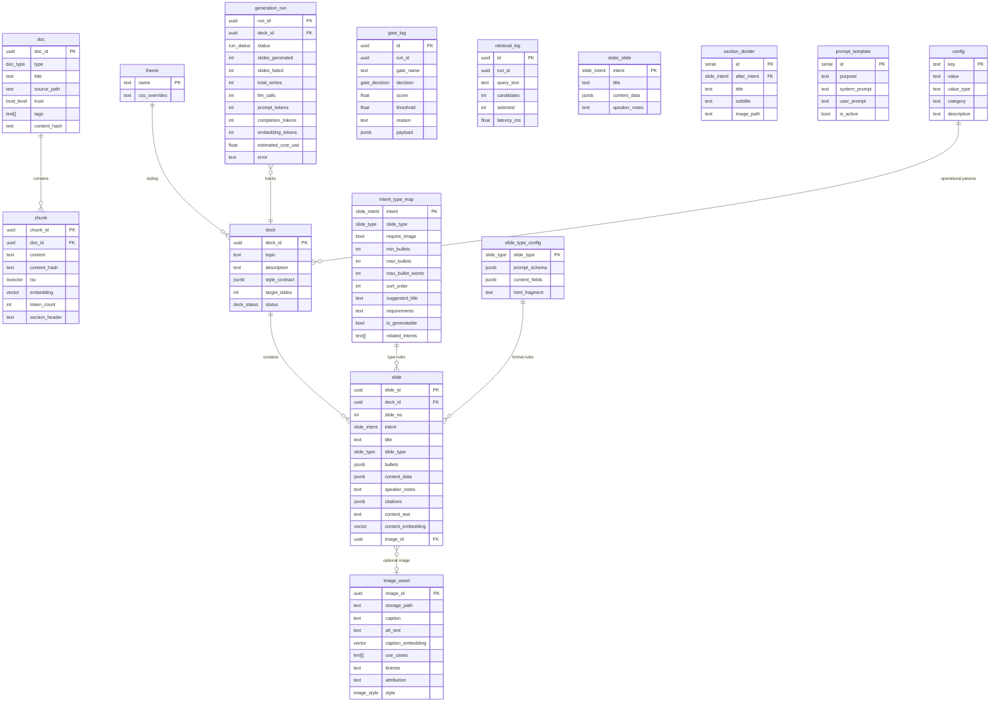

# Database

Postgres 16+ with pgvector, pg_trgm, pgcrypto, and unaccent extensions. The database owns validation, configuration, retrieval, and audit — not just storage.

## ER Diagram



## Core Tables

**8 tables in `db/schema.sql`:** `doc`, `chunk`, `deck`, `slide`, `intent_type_map`, `image_asset`, `retrieval_log`, `gate_log`

**6 tables added by migration 010:** `static_slide`, `section_divider`, `theme`, `slide_type_config`, `prompt_template`, `generation_run`

**1 table added by migration 013:** `config`

### Knowledge Base

| Table | Rows | Purpose |
|-------|------|---------|
| `doc` | ~20 | Source documents with type, trust level, and tags |
| `chunk` | ~300 | Text chunks with embeddings (VECTOR(1536)) and tsvector for hybrid search |

### Presentation

| Table | Rows | Purpose |
|-------|------|---------|
| `deck` | Per run | Presentation metadata with `deck_status` lifecycle tracking |
| `slide` | ~17 per deck | Individual slides with typed `content_data` JSONB, citations, and content embedding |

### Configuration (Control Plane)

All loaded once at startup and cached in Python. Zero per-slide overhead.

| Table | Rows | Purpose |
|-------|------|---------|
| `config` | 31 | Operational config (thresholds, model names, limits, toggles). Loaded at startup by `src/config.py`, accessed via `config.get(key)` |
| `intent_type_map` | 18 | Maps each intent to its slide_type, validation rules (min/max bullets, max words), sort order, suggested title, and generation requirements |
| `static_slide` | 2 | Title and thanks slides (not LLM-generated) |
| `section_divider` | 5 | Dividers inserted between slide groups, keyed by `after_intent` |
| `theme` | 2 | `dark` and `postgres` themes with CSS custom property overrides |
| `slide_type_config` | 6 | Per-type prompt schema, content field map, and HTML fragment for rendering |
| `prompt_template` | 5 active | System + user prompts per purpose; partial unique index enforces one active per purpose |

### Observability

| Table | Rows | Purpose |
|-------|------|---------|
| `gate_log` | ~100 per run | Every gate decision with gate name, pass/fail, score, threshold, reason, and payload. Gate names: `g0_ingestion`, `g1_retrieval`, `g2_citation`, `g2.5_grounding`, `g3_format`, `g4_novelty`, `g5_image`, `g5_commit`, `coverage_sensor`, `cost_gate` |
| `retrieval_log` | ~17 per run | Every hybrid search with query, candidate count, selected count, and latency |
| `generation_run` | 1 per run | Run-level metrics: slides generated/failed, total retries, LLM calls, token counts, cost, status, error |

## Custom Enums

| Enum | Values | Used by |
|------|--------|---------|
| `doc_type` | note, article, concept, blog, external, image | `doc.doc_type` |
| `image_style` | diagram, screenshot, chart, photo, decorative | `image_asset.style` |
| `trust_level` | low, medium, high | `doc.trust_level` |
| `gate_decision` | pass, fail | `gate_log.decision` |
| `slide_intent` | title, problem, why-postgres, comparison, capabilities, thesis, schema-security, architecture, what-is-rag, rag-in-postgres, advanced-retrieval, what-is-mcp, mcp-tools, gates, observability, what-we-built, takeaways, thanks | `slide.intent`, `intent_type_map.intent` |
| `slide_type` | statement, bullets, split, flow, diagram, code | `slide.slide_type`, `slide_type_config.slide_type` |
| `deck_status` | draft, generating, completed, failed | `deck.status` |
| `run_status` | running, completed, failed, cost_limited, cancelled | `generation_run.status` |

## Views

The "views as active sensors" pattern — these provide live insight without application-layer aggregation.

| View | Question it answers |
|------|-------------------|
| `v_deck_coverage` | Which intents are covered vs. missing for a deck? Used by the orchestrator to enrich retrieval queries with "differentiate from existing slides" context. |
| `v_deck_health` | How many retries, failures, and what completion percentage for a deck? |
| `v_gate_failures` | Which gates fail most often, and why? Aggregated by gate name and reason. |
| `v_top_sources` | Which chunks and documents are most cited across a deck? |

## Functions

### Regular Functions (16)

| Function | Purpose |
|----------|---------|
| `fn_hybrid_search(query_embedding, query_text, ...)` | Combined semantic (pgvector `<=>`) + lexical (tsvector `@@`) search via Reciprocal Rank Fusion |
| `fn_check_retrieval_quality(search_results, min_chunks, min_score)` | G1 gate: evaluate retrieval quality (enough chunks, sufficient top score) |
| `fn_check_novelty(deck_id, candidate_embedding, threshold)` | Cosine similarity check against existing slides |
| `fn_check_grounding(slide_spec, threshold, run_id)` | Verify each bullet/content item is grounded in cited chunks via embedding similarity |
| `fn_validate_slide_structure(slide_spec)` | Type-aware format validation with CASE dispatch per slide_type |
| `fn_validate_citations(slide_spec, min_citations)` | Verify all cited chunk_ids exist in the DB |
| `fn_pick_next_intent(deck_id, exclude)` | Deterministically select next missing intent using sort_order from intent_type_map |
| `fn_search_images(query_embedding, filters, top_k)` | Semantic image search by caption embedding with style/use_case filtering |
| `fn_commit_slide(deck_id, slide_no, slide_spec, ...)` | Atomic slide insert/update with G2+G3 re-validation and gate logging |
| `fn_create_deck(topic, target_slides, ...)` | Create new deck with style_contract |
| `fn_get_run_report(deck_id)` | Generate comprehensive JSON report with per-slide and per-gate details |
| `fn_get_deck_state(deck_id)` | Return deck state as JSONB (deck + coverage + health + slides) |
| `fn_log_retrieval(run_id, query_text, ...)` | Helper to insert retrieval_log rows |
| `fn_log_gate(run_id, gate_name, ...)` | Helper to insert gate_log rows |
| `fn_set_updated_at()` | Generic trigger function for `updated_at` columns |
| `fn_validate_type_config()` | Trigger function validating that `content_fields` keys appear in `html_fragment` |

### Trigger Functions (4)

| Trigger | Fires on | Purpose |
|---------|----------|---------|
| `update_chunk_tsv` | chunk INSERT/UPDATE | Auto-populate tsvector from chunk content |
| `update_slide_content_text` | slide INSERT/UPDATE | Extract plaintext from all `content_data` fields into `content_text` for novelty comparison |
| `notify_slide_committed` | slide INSERT/UPDATE | NOTIFY on `slide_committed` channel for SSE live streaming |
| `notify_gate_update` | gate_log INSERT | NOTIFY on `gate_update` channel for live gate status |

### Notable Implementation Details

- `fn_check_grounding`: SQL default threshold is 0.7, but Python passes `config.get("grounding_threshold", 0.3)` (or `config.get("grounding_threshold_diagram", 0.2)` for diagram/flow). The SQL default is never used in practice.
- `fn_commit_slide`: Hardcodes 0.7 in its gate_log entry for grounding threshold regardless of the threshold actually used during validation.
- `fn_validate_type_config`: Trigger on `slide_type_config` INSERT/UPDATE that validates `content_fields` keys appear in `html_fragment` — prevents broken rendering contracts.

## Migration History

21 forward migrations (001–019, with two 009_* files). Rollback scripts exist for 010, 012, 014, and 018.

| Migration | Purpose |
|-----------|---------|
| `001_add_images.sql` | Image support (`image_asset` table, `image_style` enum) |
| `002_live_notify.sql` | LISTEN/NOTIFY trigger functions for live server SSE |
| `003_pick_intent_exclude.sql` | Add `exclude` parameter to `fn_pick_next_intent` |
| `004_tighten_bullets.sql` | Tighten bullet validation constraints |
| `005_slide_types.sql` | `slide_type` enum, `content_data` JSONB column, extend `intent_type_map` |
| `006_typed_g3.sql` | Type-aware G3 format validation (CASE dispatch per slide_type) |
| `007_problem_image.sql` | Problem image handling |
| `008_validation_defaults.sql` | Validation default values |
| `009_raise_code_line_limit.sql` | Raise code line limit threshold |
| `009_code_line_limits.sql` | Code line limits for validation |
| `010_consolidate_config.sql` | Major consolidation: 6 new tables, 2 new enums, `deck.status`, extended `intent_type_map` |
| `011_populate_tier2.sql` | Populate `slide_type_config` and `prompt_template` with data |
| `012_render_fragments.sql` | Load HTML fragments into `slide_type_config.html_fragment` |
| `013_config_and_enums.sql` | `config` table for operational config, gate name normalization to lowercase, fn_commit_slide gate string updates |
| `014_comparison_runs.sql` | Comparison run support |
| `015_g1_retrieval_gate.sql` | G1 retrieval quality gate as PL/pgSQL function; config keys `g1_min_chunks`, `g1_min_score` |
| `016_gates_diagram_image.sql` | Gates static slide with `gate-chain-diagram.png`; `image_path`/`image_alt` columns on `static_slide` |
| `017_advanced_retrieval.sql` | `advanced-retrieval` intent (split type) for two-stage retrieval slide |
| `018_what_we_built_diagram.sql` | Change `what-we-built` from `bullets` to `diagram` with `require_image=true` |
| `019_takeaways_split_with_image.sql` | Change `takeaways` from `bullets` to `split` with `require_image=true` |

Apply all forward migrations (skips rollback scripts automatically):

```bash
for f in db/migrations/0*.sql; do
  [[ "$f" == *rollback* ]] && continue
  psql "$DATABASE_URL" -f "$f"
done
```
