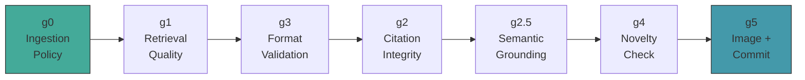

# Gate Validation

Six gates enforce quality at every stage, from content ingestion through atomic commit. Generation-time gates (G1–G5) are PL/pgSQL functions — the LLM cannot bypass them. G0 runs in Python at ingestion time.

## Gate Sequence

G0 runs at ingestion time. G1 runs after retrieval. G3 runs first after drafting (cheap format check before expensive citation/grounding lookups). G2 and G2.5 validate citations and semantic grounding. G4 checks novelty. G5 selects an image and commits atomically.

## G0: Ingestion Policy

**When:** Document ingestion (`src/ingest.py`)
**Checks:**
- Title is present and non-empty
- Content meets minimum length
- Content hash not already in DB (deduplication)

**Configurable:** No (hardcoded thresholds in Python)
**On failure:** Document is skipped with a warning

## G1: Retrieval Quality

**When:** After hybrid search, before drafting
**SQL function:** `fn_check_retrieval_quality(search_results, min_chunks, min_score)`
**MCP tool:** `mcp_check_retrieval_quality`
**Checks:**
- At least `min_chunks` (default 3) chunks returned
- Top result has `combined_score` > `min_score` (default 0.3)

**Configurable:** Yes — `g1_min_chunks` and `g1_min_score` in the config table
**On failure:** Orchestrator generates alternative queries via LLM and retries. After exhausting retries (max 5 per slide), the intent is abandoned.

## G2: Citation Integrity

**When:** After drafting, before grounding check
**SQL function:** `fn_validate_citations(slide_spec, min_citations)`
**MCP tool:** `mcp_validate_citations`
**Checks:**
- All `chunk_id` values in the slide's `citations` array exist in the `chunk` table
- At least `min_citations` (default 1) citations present

**On failure:** Returns list of invalid chunk_ids. Triggers format rewrite with citation details.

## G2.5: Semantic Grounding

**When:** After citation validation
**SQL function:** `fn_check_grounding(slide_spec, threshold, run_id)`
**MCP tool:** `mcp_check_grounding`
**Checks:**
- Each bullet/content item's embedding is compared against the embeddings of its cited chunks
- Cosine similarity must exceed the threshold

**Thresholds:**

| Slide type | Threshold | Config key | Reason |
|-----------|-----------|---------|--------|
| bullets, statement, split | 0.3 | `grounding_threshold` | Standard text content |
| diagram, flow | 0.2 | `grounding_threshold_diagram` | Shorter text produces lower cosine similarity |

**On failure:** Returns per-bullet scores. Triggers grounding rewrite with specific failure details (which bullets failed and their scores).

**Note:** The SQL function's default threshold is 0.7, but Python always passes 0.3 (or 0.2 for diagrams). The SQL default is never used in practice.

## G3: Format Validation

**When:** After drafting (checked before citations in the gate sequence, but after drafting)
**SQL function:** `fn_validate_slide_structure(slide_spec)`
**MCP tool:** `mcp_validate_slide_structure`
**Checks (type-aware CASE dispatch):**

| Slide type | Validations |
|-----------|------------|
| `bullets` | Bullet count within `min_bullets`–`max_bullets`, each bullet under `max_bullet_words` |
| `statement` | Statement present, within length limits |
| `split` | Two columns present, balanced content |
| `flow` | Steps array present, step count within limits |
| `code` | Code block present, line count within limit |
| `diagram` | Diagram definition present |

Thresholds come from `intent_type_map` (per-intent rules) and `slide_type_config` (per-type rules), both loaded from Postgres.

**On failure:** Returns specific violations (e.g., "too many bullets: 8, max is 6"). Triggers format rewrite.

## G4: Novelty Check

**When:** After all other content gates pass
**SQL function:** `fn_check_novelty(deck_id, candidate_embedding, threshold)`
**MCP tool:** `mcp_check_novelty`
**Checks:**
- Candidate slide's `content_embedding` is compared against all existing slides in the deck
- Maximum cosine similarity must be below the threshold

**Threshold:** 0.85 (`novelty_threshold` in config table). Slides with similarity >= 0.85 to an existing slide are considered duplicates.

**On failure:** Returns the similarity score and which existing slide is too similar. Triggers novelty rewrite.

## G5: Atomic Commit

**When:** Final commit to database
**SQL function:** `fn_commit_slide(deck_id, slide_no, slide_spec, ...)`
**MCP tool:** `mcp_commit_slide`
**Checks:**
- Re-validates G2 (citations) and G3 (format) at INSERT time
- Logs all gate decisions atomically to `gate_log`

This is the "trust but verify" layer — even if a bug in the orchestrator skipped a gate, `fn_commit_slide` catches it.

**On failure:** The INSERT is rejected. The orchestrator sees a commit failure and can retry.

## Gate Logging

Every gate decision is written to `gate_log`:

| Column | Content |
|--------|---------|
| `run_id` | Links to `generation_run` |
| `gate_name` | `g0_ingestion`, `g1_retrieval`, `g2_citation`, `g2.5_grounding`, `g3_format`, `g4_novelty`, `g5_image`, `g5_commit`, `coverage_sensor`, `cost_gate` |
| `decision` | `pass` or `fail` |
| `score` | Numeric score (similarity, count, etc.) |
| `threshold` | The threshold used for this check |
| `reason` | Human-readable explanation |
| `payload` | Full details as JSONB (per-bullet scores, violation list, etc.) |

Gate names are constrained by a CHECK constraint on `gate_log.gate_name`.

For querying gate logs and failure analysis, see [observability.md](observability.md).
