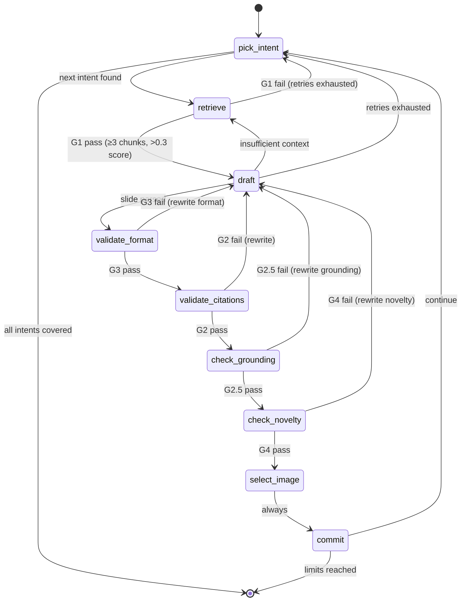

# Orchestrator

The LangGraph state machine in `src/orchestrator.py` that drives slide generation. Python orchestrates the loop; the LLM drafts content; Postgres validates and stores.

## State Machine



## Nodes

| Node | Function | Purpose |
|------|----------|---------|
| `pick_intent` | `pick_intent_node()` | Call `fn_pick_next_intent` to get the next missing intent by `sort_order`. Tracks abandoned intents. Exits the graph when all generatable intents are covered. |
| `retrieve` | `retrieve_node()` | Hybrid search enriched with `v_deck_coverage` context. Applies G1 gate via `mcp_check_retrieval_quality` (config: `g1_min_chunks`=3, `g1_min_score`=0.3). On failure, generates alternative queries via LLM. |
| `draft` | `draft_node()` | Call the LLM to draft a slide or rewrite based on `last_failure_type` (format, grounding, novelty). Tracks cost per call. Parses LLM response into structured slide spec. |
| `validate_format` | `validate_format_node()` | G3: call `mcp_validate_slide_structure`. Type-aware validation (bullet count, statement length, column balance, step counts, code line limits). |
| `validate_citations` | `validate_citations_node()` | G2: call `mcp_validate_citations`. All cited chunk_ids must exist in DB. |
| `check_grounding` | `check_grounding_node()` | G2.5: call `mcp_check_grounding`. Uses 0.3 threshold for bullets, 0.2 for diagram/flow (shorter text has lower similarity). |
| `check_novelty` | `check_novelty_node()` | G4: call `mcp_check_novelty`. Embedding similarity against existing slides must be below 0.85. |
| `select_image` | `select_image_node()` | Optional image selection with dedup (exclude `used_image_ids`), intent-boosted weighted random, and G5 validation. Controlled by `image_selection_enabled` config key. |
| `commit` | `commit_node()` | Call `mcp_commit_slide` which re-validates G2+G3 atomically at INSERT time and logs all gates. |

## Generation Loop

One slide is generated through this cycle:

1. **Intent selection:** `fn_pick_next_intent` returns the next missing intent by canonical sort order, excluding previously abandoned intents.
2. **Retrieval:** Hybrid search with coverage enrichment. If G1 fails, the LLM generates alternative queries and the node retries.
3. **Drafting:** The LLM receives retrieved chunks, the intent metadata (from `intent_type_map`), and the prompt template (from `prompt_template`). It produces a structured slide spec.
4. **Gate validation:** The draft passes through G3 → G2 → G2.5 → G4 sequentially. Each gate returns pass/fail with details.
5. **Rewrite loop:** On gate failure, the draft returns to the `draft` node with `last_failure_type` and `last_failure_details` set. The LLM receives the specific failure reason and rewrites only the failing aspect.
6. **Image selection:** If enabled and the intent requires an image, semantic search with dedup and validation.
7. **Commit:** Atomic insert with server-side re-validation.

## Rewrite Strategy

Gate failures trigger targeted rewrites. The `last_failure_type` determines which rewrite function is called:

| Failure type | Rewrite function | What the LLM is told |
|-------------|-----------------|---------------------|
| `format` | `rewrite_slide_format()` | Specific format violations (e.g., "too many bullets: 8, max is 6") |
| `grounding` | `rewrite_slide_grounding()` | Which bullets failed grounding and their scores |
| `novelty` | `rewrite_slide_novelty()` | Similarity score and the existing slide it's too similar to |

The rewrite prompt includes the original draft, the failure details, and the retrieved chunks — so the LLM can fix the specific issue without starting from scratch.

## Safety Limits

Five configurable limits prevent runaway generation:

| Limit | Config key | Default | Behavior when reached |
|-------|---------|---------|----------------------|
| Per-slide retries | `max_retries_per_slide` | 5 | Abandon current intent, move to next |
| Global retry budget | `max_total_retries` | 100 | End generation |
| LLM API call cap | `max_llm_calls` | 200 | End generation |
| Cost ceiling | `cost_limit_usd` | 10.00 | End generation with `cost_limited` status |
| Failed intent limit | `max_failed_intents` | 3 | Trigger fallback mode |

When `max_failed_intents` is reached, `fallback_triggered` is set. The orchestrator continues generating but with reduced expectations.

## State Management

`OrchestratorState` (Pydantic model in `src/models.py`) tracks everything per run:

**Per-slide:** `current_intent`, `current_slide_no`, `current_chunks`, `current_draft`, `current_gate_results`, `last_failure_type`, `last_failure_details`, `slide_retries`

**Per-run:** `deck_id`, `run_id`, `target_slides`, `generated_slides`, `failed_intents`, `abandoned_intents`, `total_retries`, `is_complete`, `error`, `fallback_triggered`

**Cost tracking:** `llm_calls`, `embeddings_generated`, `prompt_tokens`, `completion_tokens`, `embedding_tokens`, `estimated_cost_usd`

**Image tracking:** `used_image_ids`, `images_deduplicated`

## Generation Run Lifecycle

The `generation_run` table tracks each execution end-to-end:

```
1. _start_generation_run()     → INSERT generation_run (status: running)
2. _set_deck_status("generating")  → UPDATE deck.status
3. LangGraph graph executes    → pick_intent → ... → commit (loop)
4. _determine_run_status()     → Map exit state to run_status:
                                   - Normal completion → "completed"
                                   - Cost limit hit    → "cost_limited"
                                   - Error/exception   → "failed"
5. _complete_generation_run()  → UPDATE generation_run with final metrics
6. _set_deck_status(...)       → "completed" or "failed"
                                   (cost_limited → "completed")
```

**Stale cleanup:** `cleanup_stale_generating()` runs at startup to reset any decks/runs left in `generating`/`running` state from a previous crash.

## Python's Role

Python makes **no quality decisions**. Its responsibilities are:

- **Loop orchestration:** LangGraph graph compilation and execution
- **Cost accounting:** Token counting and USD estimation
- **Routing:** Conditional edges based on gate results
- **Retry logic:** Counting retries, deciding when to abandon an intent
- **State management:** Tracking what's been generated, what's failed, what's left

Every quality judgment — format compliance, citation integrity, semantic grounding, content novelty — is a Postgres function called through an MCP tool.
